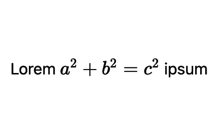
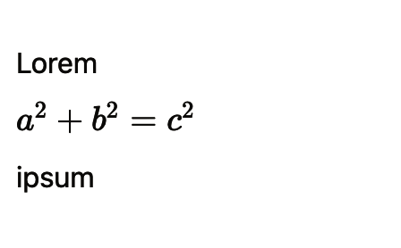
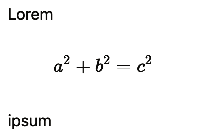

# md2notion

This repository is a small enhancement on top of [md2notion](https://github.com/Cobertos/md2notion) to preserve math formatting when using [md2notion](https://github.com/Cobertos/md2notion) to import markdown files to [Notion](https://notion.so).

## Dependencies

[`md2notion`](https://github.com/Cobertos/md2notion)

[`notion`](https://github.com/jamalex/notion-py)

[`mistletoe`](https://github.com/miyuchina/mistletoe)

> [`notion`](https://github.com/jamalex/notion-py) and [`mistletoe`](https://github.com/miyuchina/mistletoe) are likely already installed if you've ran `pip install md2notion`.

## Usage

See [`example.py`](./example.py) for a boilerplate script to import files from a directory to a Notion page.

### Equations
<table>
<tr>
<th>
Markdown
</th>
<th>
Result in Notion
</th>
</tr>

<tr>

<td>
<pre>
 Lorem $ a^2 + b^2 = c^2 $ ipsum 
</pre>
</td>

<td>

</td>

</tr>

<tr>

<td>
<pre>
 Lorem  $$ a^2 + b^2 = c^2 $$  ipsum 
</pre>
</td>

<td>

</td>

</tr>

<tr>

<td>
<pre>
 Lorem  $$ a^2 + b^2 = c^2 $$  ipsum 
</pre>
</td>

<td>

</td>

</tr>

</table>